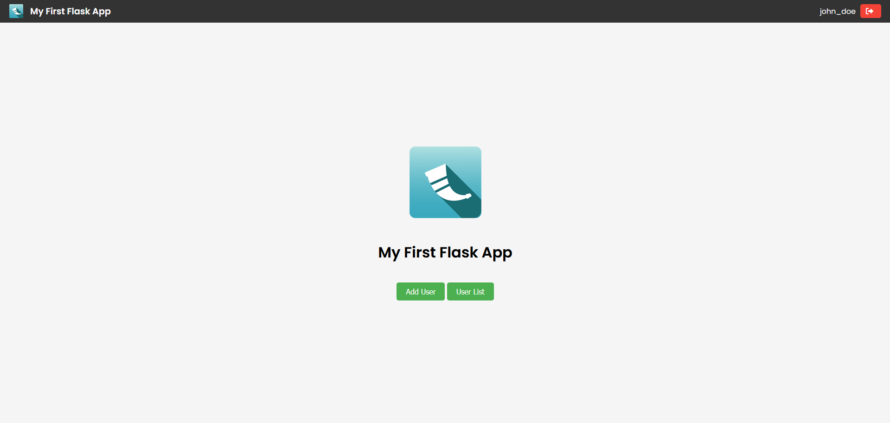
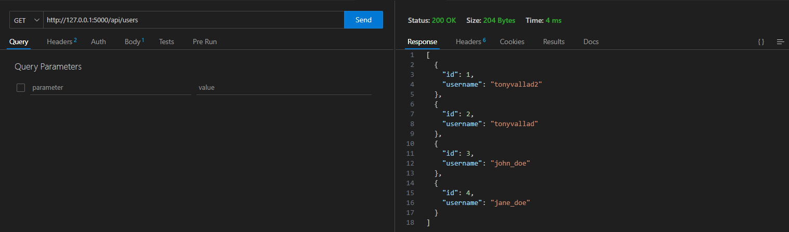
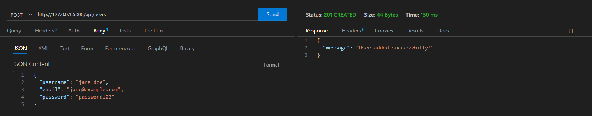

### **<h1 align="center">Flask Practice Project</h1>**

<p align="center">
  
</p>

This project is a simple Flask application built to learn the basics of the Flask web framework, including:

- Creating an API REST with Flask.
- Developing a simple web application with user management.
- Using SQLite as the database.
- Handling forms and validating data with Flask-WTF and SQLAlchemy.
- Implementing database models with SQLAlchemy.
- Implementing login/logout functionality with session management.

---



---

### **Table of Contents**

1. [Features](#features)
2. [Installation](#installation)
3. [Usage](#usage)
4. [API Endpoints](#api-endpoints)
5. [Technologies Used](#technologies-used)
6. [Project Structure](#project-structure)
7. [How the Project Works](#how-the-project-works)
8. [Future Improvements](#future-improvements)

---

### **Features**

- **User Management**: Users can be added through a web form, and a list of all users can be viewed (accessible only when logged in).
- **Login/Logout**: Users can log in and log out. When logged in, the username is displayed on the top banner, and when logged out, a login button is shown.
- **Session Management**: Flask-Login is used to manage user sessions.
- **API**: A simple REST API allows adding users via POST requests and fetching the list of users via GET requests.
- **Email and Username Validation**:
  - Usernames are validated for uniqueness, and can only contain letters, numbers, and certain special characters.
  - Email addresses are validated for proper format and uniqueness.
- **Database**: SQLite database stored in the `instance` folder (using SQLAlchemy).
- **Password Hashing**: User passwords are hashed before being stored in the database using `Werkzeug`.

---

### **Installation**

1. **Clone the repository**:

   ```bash
   git clone https://github.com/TonyVallad/Flask-practice-project.git
   cd Flask-practice-project
   ```

2. **Create a virtual environment** (recommended):

   ```bash
   python -m venv venv
   ```

3. **Activate the virtual environment**:
   - On Windows:
     ```bash
     .\venv\Scripts\activate
     ```
   - On macOS/Linux:
     ```bash
     source venv/bin/activate
     ```

4. **Install the dependencies**:

   ```bash
   pip install -r requirements.txt
   ```

5. **Set up the SQLite database**:
   The database will be automatically created when you run the application if it doesn't exist.

---

### **Usage**

1. **Run the Flask application**:

   ```bash
   python run.py
   ```

2. **Access the application**:
   - Open your web browser and go to `http://127.0.0.1:5000/`.

---

### **API Endpoints**

- **GET /api/users**: Fetch the list of all users.
- **POST /api/users**: Add a new user via JSON request. Example request body:

  ```json
  {
    "username": "john_doe",
    "email": "john@example.com",
    "password": "password123"
  }
  ```

---

### **Technologies Used**

- **Flask**: Web framework used to build the application.
- **SQLAlchemy**: ORM used to interact with the SQLite database.
- **Flask-WTF**: Form handling and validation library.
- **Flask-Login**: User session management and authentication.
- **Werkzeug**: Used for password hashing.
- **SQLite**: Lightweight database for storing user information.
- **Flask-CORS**: To enable CORS support.

---

### **Project Structure**

```plaintext
Flask-practice-project/
├── app/
│   ├── __init__.py          # Initializes the Flask app and sets up the database
│   ├── routes.py            # Contains the app's routes and API endpoints
│   ├── models.py            # Defines the User model for SQLAlchemy
│   ├── forms.py             # Contains form validation logic using Flask-WTF
│   ├── auth.py              # Handles login/logout and user authentication
│   ├── templates/           # Contains HTML templates
│   │   ├── base.html        # Base template
│   │   ├── index.html       # Home page
│   │   ├── add_user.html    # Form to add a new user
│   │   ├── login.html       # Login page
│   │   └── list_users.html  # Displays a list of all users
│   ├── static/              # Contains static files (CSS, images)
│   └── database.py          # Initializes the SQLite database
├── instance/
│   └── database.db          # SQLite database (automatically created)
├── config.py                # App configuration
├── run.py                   # Entry point for running the Flask app
├── requirements.txt         # Lists the project dependencies
└── README.md                # Project documentation
```

---

### **How the Project Works**

1. When the application starts, the SQLite database is automatically created in the `instance` folder (if it doesn't already exist).
2. Users can be added through the `/add_user` page. Their passwords are hashed before being stored in the database.
3. The `/list_users` page is protected and displays all users in the database, but only when the user is logged in.
4. The API allows for adding users via POST requests and fetching users via GET requests.
5. Login and logout functionality is implemented using Flask-Login, and error messages are shown below the form fields for unrecognized usernames or incorrect passwords.

---

### **Future Improvements**

- Add user registration and password reset functionality.
- Implement session expiration after a period of inactivity.
- Add more advanced features like user roles and permissions.
- Implement pagination for the user list.

---

### **Screenshots**

Here are some screenshots of the API tests.

- API GET:


- API POST:


---

### **License**

This project is licensed under the MIT License. You are free to use, modify, and distribute this software in any project, personal or commercial, provided that you include a copy of the original license and copyright notice.

For more information, see the [LICENSE](LICENSE) file.