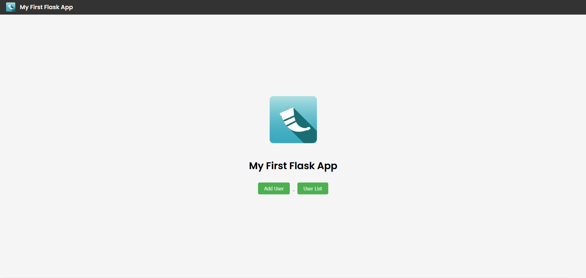
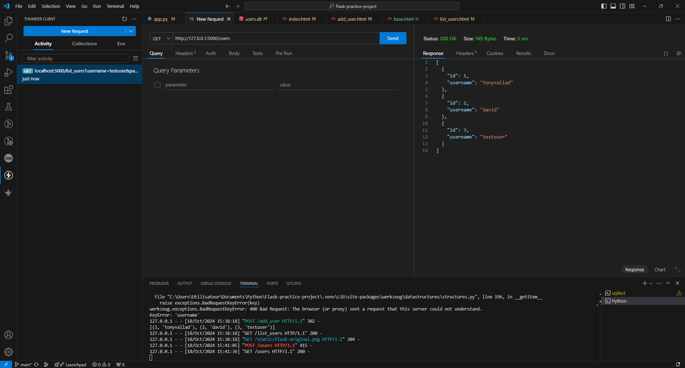
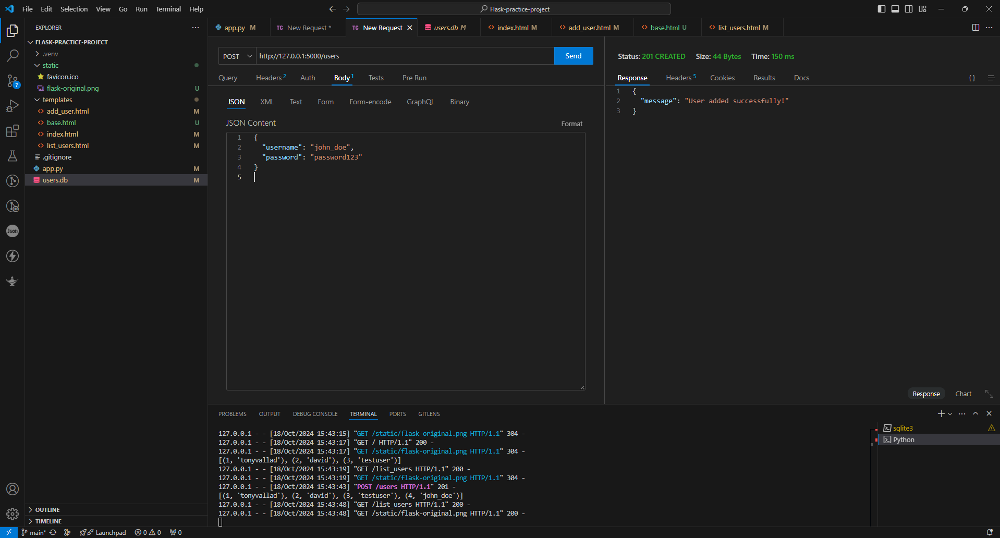

# Flask Practice Project

<p align="center">
  
</p>

This project is a simple Flask-based web application designed to demonstrate core concepts of building a REST API, managing user sessions, and implementing basic security features such as password hashing. It includes example endpoints for handling user data and interacting with a SQLite database.

## Table of Contents
1. [Project Overview](#project-overview)
2. [Features](#features)
3. [Getting Started](#getting-started)
4. [API Endpoints](#api-endpoints)
5. [Screenshots](#screenshots)
6. [Technologies](#technologies)
7. [Contributing](#contributing)
8. [License](#license)

## Project Overview

This project serves as a hands-on learning exercise for creating REST APIs with Flask, managing user sessions, and storing user data in a SQLite database. The goal is to build a functional web application with endpoints for user login, registration, and basic CRUD operations, all while ensuring data is secure.

## Features

- User authentication (login, logout, and session management)
- Password security with hashing
- SQLite integration for user data storage
- RESTful API for basic CRUD operations
- Example requests for GET and POST methods
- Simple front-end interface built with HTML/CSS

## Getting Started

To run the project locally, follow these steps:

### Prerequisites
- Python 3.x
- Flask
- SQLite

### Installation
1. Clone the repository:
    ```bash
    git clone https://github.com/TonyVallad/Flask-practice-project.git
    ```
2. Navigate to the project directory:
    ```bash
    cd Flask-practice-project
    ```
3. Install the dependencies:
    ```bash
    pip install -r requirements.txt
    ```
4. Run the Flask app:
    ```bash
    flask run
    ```
5. Access the application at `http://127.0.0.1:5000/`.

## API Endpoints

### GET /users
Retrieve all registered users.
```bash
curl -X GET http://127.0.0.1:5000/users
```

### POST /register
Register a new user with the following JSON data:
```bash
curl -X POST http://127.0.0.1:5000/register -H "Content-Type: application/json" -d '{"username": "user1", "password": "password123"}'
```

### More endpoints to come...

## Screenshots

- **Main Interface**  
  

- **GET API Test (Thunder Client)**  
  

- **POST API Test (Thunder Client)**  
  

## Technologies

- Python 3.x
- Flask
- SQLite
- HTML/CSS (for the front-end)

## Contributing

Contributions are welcome! If you'd like to contribute, please fork the repository and use a feature branch. Pull requests are warmly welcome.

## License

This project is licensed under the MIT License - see the [LICENSE](LICENSE) file for details.